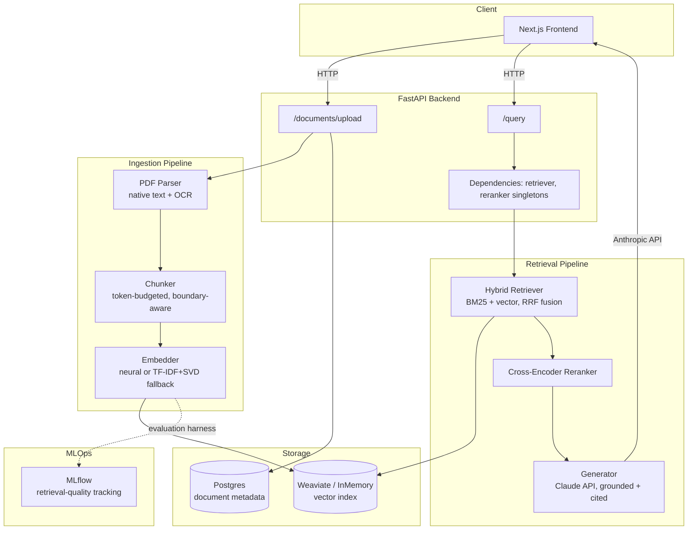
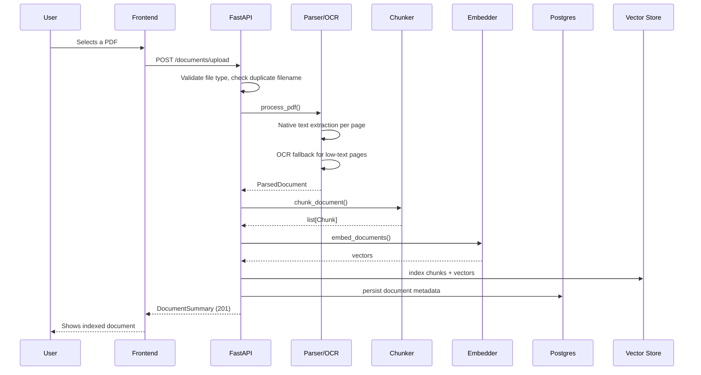
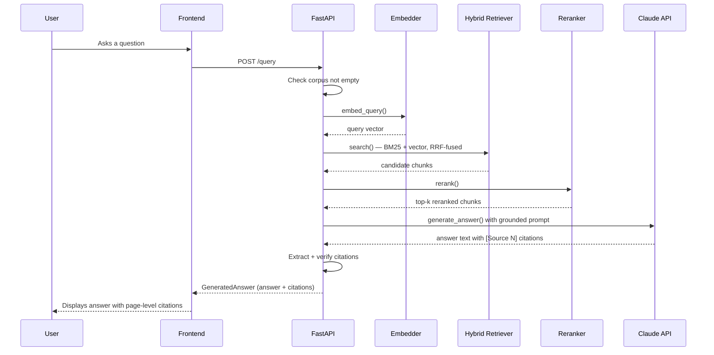

# Architecture

## System overview

## Why this shape

Ingestion and retrieval are deliberately separate subsystems (see Module 1's rationale) — they have different performance characteristics: ingestion is batch-oriented and I/O-heavy (PDF parsing, OCR), while retrieval must be low-latency and synchronous. Keeping them as independent pipelines means they can be reasoned about, tested, and eventually scaled independently.

## The two request flows

### Upload flow

### Query flow

## Key design decisions and their rationale

| Decision | Why |
|---|---|
| Hybrid retrieval (BM25 + vector) over vector-only | Pure semantic search under-ranks exact terms (invoice numbers, regional codes) |
| Two-stage retrieval (fast recall → precise rerank) | Cross-encoders are too slow to run over an entire corpus; bi-encoders can't match a cross-encoder's precision |
| Citations re-derived from the response text, not echoed from input | Keeps citations honest — reflects what the model actually used, not everything it was given |
| Every network-dependent component has a tested local fallback | This project was built in a network-restricted sandbox; the same pattern (tokenizer, embedder, reranker) also protects a real deployment against a model-hub outage |
| Ingestion/retrieval separated into independent subsystems | Different performance profiles (batch/I-O-heavy vs. low-latency/synchronous); independently testable and scalable |
